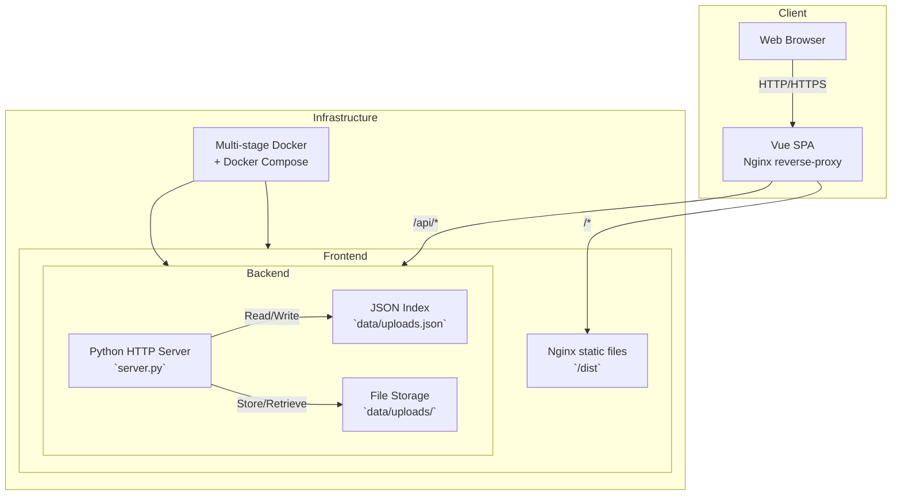

# Architecture Overview

## Overview

This repository hosts a fullstack web application composed of a Python-based backend API server and a JavaScript/TypeScript frontend built with Vue 3, Vite, and modern web tooling. The backend is implemented using Python's built-in `http.server` module, providing a lightweight, self-contained REST-like API with support for file uploads, software package manifest generation, and custom install instructions for Debian-based systems. The frontend is a client-side single-page application (SPA) served via Nginx and optimized for production with static asset handling, API abstraction, and responsive design patterns.

The architecture follows a clean separation of concerns: the backend exposes a minimal but extensible HTTP API with explicit security considerations (e.g., HTML sanitization, path traversal protection), while the frontend communicates with it over HTTP using structured requests. Persistent storage is file-based, using a JSON index (`uploads.json`) and a dedicated `data/uploads/` directory—ideal for lightweight, local deployments without external databases.

The project is containerized using Docker and orchestrated via Docker Compose, enabling reproducible local development and consistent deployments across environments. A CI/CD pipeline defined in GitHub Actions ensures automated testing, linting, and image building.

---

## Frontend

The frontend is built using Vue 3 (via the Composition API), Vite as the build tool, and Nginx as the production web server. It resides in the `web/` directory and includes:

- **Entry point**: `web/src/main.js` initializes the Vue app.
- **Root component**: `web/src/App.vue` provides layout structure and navigation.
- **API integration**: `web/src/api.js` abstracts RESTful communication with the backend, including upload and manifest retrieval endpoints.
- **Static assets & configuration**: `web/index.html`, `web/vite.config.js`, `web/nginx.conf`, and `web/.dockerignore` coordinate the bundling, local serving, and production deployment via Nginx.

The frontend is decoupled from the backend, using relative API paths (`/api/...`) for service discovery—allowing flexibility in deployment (e.g., local dev server, CDN, reverse proxy). It does not rely on external CDNs or heavy UI frameworks, maintaining a minimal, secure, and performant codebase.

---

## Backend

The backend is a Python 3.11-based HTTP server (`server.py`) implementing a custom REST-like API without external dependencies like Flask or FastAPI. It leverages Python’s standard library (`http.server`, `json`, `pathlib`) to serve endpoints dynamically. Key design principles include:

- **Thread-safety**: Uses `ThreadingHTTPServer` to handle concurrent requests efficiently.
- **Security**: Sanitizes user input using `html.escape`, restricts file upload paths via `Path.resolve()`, and prevents path traversal attacks.
- **State persistence**: Maintains an `uploads.json` index to track uploaded files and metadata, including timestamps and software manifest generation history.

### Endpoints (9 total)

1. `GET /api/status` – Returns health check and runtime metadata (Python version, uptime).
2. `GET /api/manifest` – Generates an install manifest (with Debian/Ubuntu `apt` examples) for a list of requested packages.
3. `POST /api/manifest` – Accepts a JSON payload with `software` field to generate custom install manifests.
4. `GET /api/uploads` – Lists all uploaded files.
5. `POST /api/upload` – Accepts multipart/form-data file uploads, stores them in `data/uploads/`, and indexes metadata.
6. `GET /api/upload/:id` – Retrieves metadata and download link for a specific upload by ID.
7. `DELETE /api/upload/:id` – Removes a file and its index entry (idempotent).
8. `GET /api/defaults` – Returns the default list of software packages (e.g., `curl`, `vim`, `git`).
9. `GET /` – Serves the SPA’s `index.html` (fallback for frontend routes).

All endpoints follow consistent patterns: JSON responses for API requests, HTML fallback for root routing, and explicit HTTP status codes (`200 OK`, `201 Created`, `400 Bad Request`, `404 Not Found`, `500 Internal Server Error`).

### Storage

Data is stored locally:
- **`data/`**: Root for persistent state.
- **`data/uploads/`**: Binary file storage directory (non-privileged, isolated).
- **`data/uploads.json`**: JSON index mapping upload IDs to file metadata (path, name, timestamp, original MIME-like hints).

Storage is designed for simplicity and portability, avoiding database dependencies—suitable for development, edge cases, or low-volume deployments. Production use may require migration to persistent volumes or external object storage.

---

## Containers

The project uses a multi-stage Docker setup for the backend and frontend services.

### Backend Container (`Dockerfile`)

- **Base image**: `python:3.11-slim`
- **Build context**: Root (`.`) with minimal layers (`COPY server.py data/` only if needed).
- **Runtime**: Uses Python’s built-in `http.server` module; no additional system packages are pre-installed beyond the slim image.
- **Volume mapping**: `data/` should be mounted as a volume for persistence across restarts.

### Frontend Container (`web/Dockerfile`)

- **Build stage**: Uses Node.js base image to run `npm install` and `vite build`, producing optimized static assets in `dist/`.
- **Production stage**: Uses `nginx:alpine` to serve built assets and handle HTTP/2, compression, and error pages (configured via `web/nginx.conf`).
- **Entrypoint**: Nginx starts on port `80`, serving `dist/`.

### Orchestration (`docker-compose.yml`)

- Defines two services: `backend` and `frontend`.
- Backend exposes port `8000`.
- Frontend depends on backend and exposes port `80`, reverse-proxies `/api` routes to the backend container via Nginx `proxy_pass`.
- Uses named volumes for `data/` persistence (mounted only in backend service).

This setup enables local development with `docker-compose up --build`, hot-reload for frontend in dev (via `vite dev` outside Docker), and production-grade deployments using `docker-compose up -d`.

---

## CI/CD

GitHub Actions CI pipelines (`\.github\workflows\main.yml`) enforce quality gates:

- **Linting**: Lints Python (`flake8`/`pylint` heuristic), JavaScript/TypeScript (`eslint`), and YAML (`actionlint`, `docker-compose` schema).
- **Testing**: Runs unit tests (if present), validates API contracts (via `curl` health checks), and ensures Docker builds succeed.
- **Security scanning**: Scans Docker images and dependencies for known vulnerabilities (e.g., `trivy`, `npm audit`).
- **Image publishing**: Pushes container images to a registry (e.g., GitHub Container Registry) on `main` branch merges.

Required secrets (e.g., `REGISTRY_USERNAME`, `REGISTRY_PASSWORD`) are configured in repository settings for publishing.

---

## Repository Layout

```
├── .github/                    # CI/CD configurations
│   └── workflows/
│       └── main.yml           # GitHub Actions pipeline
├── data/                       # Runtime data (generated on first run)
│   ├── uploads/               # Uploaded files
│   └── uploads.json           # File metadata index
├── docs/                       # Documentation
│   └── openapi.yaml           # OpenAPI 3.0 specification for API
├── web/                        # Frontend (Vue 3 + Vite)
│   ├── src/
│   │   ├── main.js            # App entry point
│   │   ├── App.vue            # Root component
│   │   └── api.js             # HTTP client abstraction
│   ├── dist/                   # Built assets (generated)
│   ├── nginx.conf              # Nginx server block (routes, gzip, caching)
│   ├── Dockerfile              # Multi-stage frontend container build
│   ├── .dockerignore          # Exclude dev files from container
│   ├── index.html              # HTML entry point
│   ├── package.json            # NPM dependencies (Vue, Vite, etc.)
│   ├── package-lock.json       # Lockfile for reproducible builds
│   └── vite.config.js          # Vite config (Vue plugin, path aliases)
├── Dockerfile                  # Backend container build
├── docker-compose.yml          # Service orchestration
├── server.py                   # Python backend API server
├── .dockerignore              # Exclude dev artifacts from backend image
├── .gitignore                 # Git-excluded patterns (e.g., `data/`, `node_modules/`)
├── README.md                  # Project overview and quickstart
└── LICENSE                    # Project license (Apache-2.0)
```

This layout emphasizes modularity, clarity, and ease of onboarding: the backend and frontend are cleanly separated but co-located for monorepo simplicity, with shared configuration (e.g., `Dockerfile` at root) and minimal coupling.

---

## System Diagram



- **Client**: Browser interacting with the SPA and API.
- **Frontend**: Vue app bundled and served via Nginx with reverse proxy to `/api`.
- **Backend**: Threaded Python HTTP server with file and metadata storage.
- **Infrastructure**: Containerized via Docker for portability and consistency.

---

## Install Requirements

### Prerequisites (for local development without Docker)

- **Python ≥ 3.11**  
  - macOS: `brew install python`  
  - Ubuntu/Debian: `sudo apt-get install python3.11 python3-pip`  
  - Windows: Install from [python.org](https://www.python.org/downloads/)

- **Node.js ≥ 20 & npm ≥ 10**  
  - macOS: `brew install node`  
  - Ubuntu/Debian: `curl -fsSL https://deb.nodesource.com/setup_20.x | sudo -E bash - && sudo apt-get install -y nodejs`  
  - Windows: Download from [nodejs.org](https://nodejs.org/)

- **Docker & Docker Compose** *(recommended for consistency)*  
  - macOS/Windows: Install Docker Desktop  
  - Linux (Ubuntu):  
    ```bash
    sudo apt-get update && sudo apt-get install docker.io docker-compose-plugin
    sudo usermod -aG docker $USER  # Re-login for group changes
    ```

### Backend Setup (Python)

1. Clone the repository.
2. Install dependencies (none beyond stdlib—no `requirements.txt` needed).
3. Run the server:
   ```bash
   python server.py --port 8000
   ```
   - Optional flags: `--host 0.0.0.0 --port 8000`
   - First run creates `data/` and `data/uploads/`.

### Frontend Setup (JavaScript)

1. Navigate to `web/`.
2. Install dependencies:
   ```bash
   npm install
   ```
3. Run dev server:
   ```bash
   npm run dev
   ```
   - Accessible at `http://localhost:5173` (Vite default).
   - Proxy `/api` to `http://localhost:8000` automatically (configured in `vite.config.js`).

4. Build for production:
   ```bash
   npm run build
   ```
   - Output: `web/dist/`.

### Containerized Setup (Docker Compose)

1. Ensure `docker-compose` is available.
2. Build and run:
   ```bash
   docker-compose up --build -d
   ```
   - Backend: `http://localhost:8000`
   - Frontend (with `/api` proxy): `http://localhost:8000`
   - Data persists in `./data` (local directory) or named volume.

---

## Future Considerations

- **Scalability**: Replace `data/` storage with object storage (e.g., MinIO, S3) for horizontal scaling.
- **Auth**: Integrate JWT or OAuth2 for protected endpoints.
- **Testing**: Add pytest and Vitest test suites.
- **Observability**: Add structured logging (e.g., `structlog`) and metrics (e.g., Prometheus).
- **OpenAPI Refinement**: Enhance `docs/openapi.yaml` with request/response schemas, examples, and authentication.

--- 

*Last updated based on repository state (2025-04-05).*
